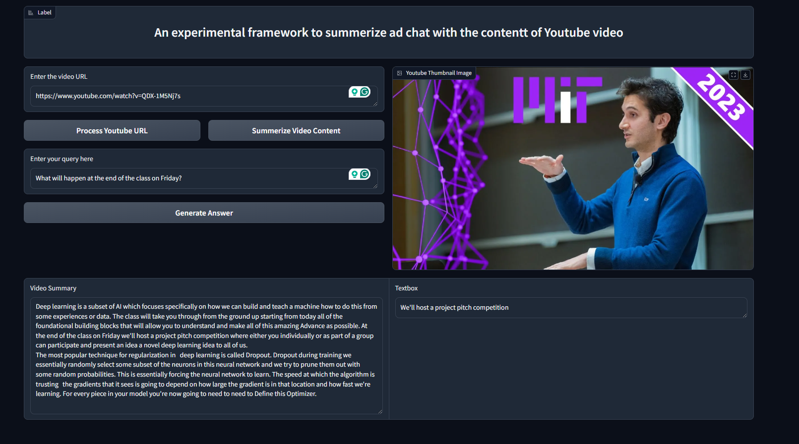

# Video Processing with LangChain and Gradio locally using LLM and RAG

This project processes YouTube videos to generate summaries using LangChain, HuggingFace, and Gradio. It includes a graphical user interface (GUI) for ease of use.

**Note:** This is a local project which means the more powerful device you have, the more powerful model can be used, which reflects on the accuracy of the generated text.
The better case is using OpenAI API, but it costs money for every process.




## Prerequisites

- Python 3.7 or higher
- pip (Python package installer)
- Nvidia GPU

## Installation

1. Clone the repository:

2. Install the required packages:
    ```sh
    pip install -r requirements.txt
    ```

## Running the Project

1. Ensure all dependencies are installed.
2. Run the main script:
    ```sh
    python Main_with_GUI.py
    ```
3. In the terminal, a local URL appears, use it on the browser to get the GUI.

## Usage

1. Enter the YouTube video URL in the provided input field.
2. Click the "Process URL" button to fetch and process the video.
3. Click the "Summarize" button to generate a summary of the video content.
4. Write your query and press generate an answer for your question


## License

This project is licensed under the MIT License. See the `LICENSE` file for details.

## Acknowledgements

- [LangChain](https://github.com/langchain/langchain)
- [HuggingFace](https://huggingface.co/)
- [Gradio](https://gradio.app/)
